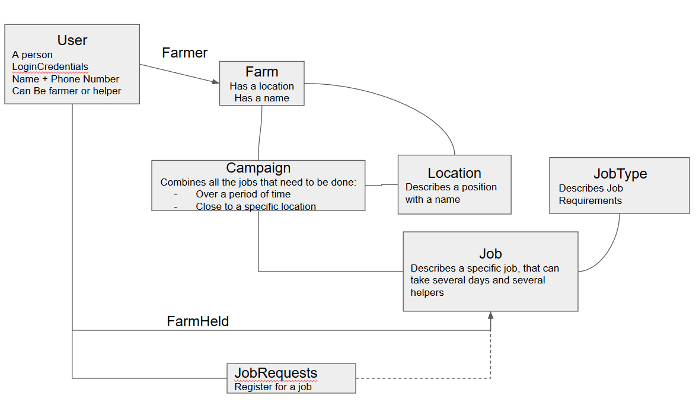

## Prerequisites
docker-compose

## Install & Run
```bash
docker-compose up
```

## Use Django Management Commands:
Use this while `docker-compose up` is running. Open a second terminal tab and execute to get a shell on the python api container:
```bash
./manage.sh
```

## Useful Django Management Commands

### create superuser
```bash
./manage.sh # on host
python manage.py createsuperuser --email admin@example.com --username admin # in container
``` 

### fill database with seed values
```bash
./manage.sh # on host
python manage.py seedDbData # in container
``` 

# API definition

Server and client communicate via REST API,  [the Documentation can be found here](https://app.swaggerhub.com/apis-docs/wirvsvirus/farmhelden/1.0.0)


## Database Structure

